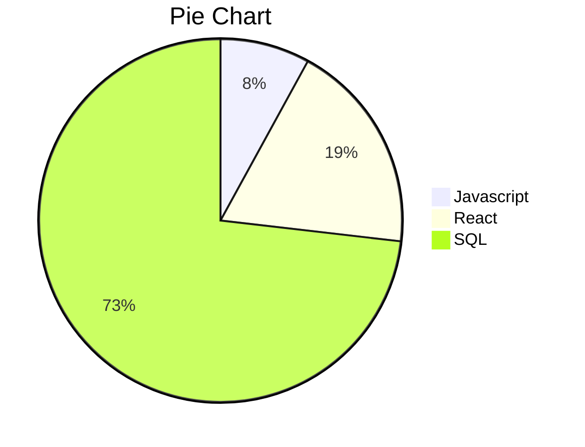
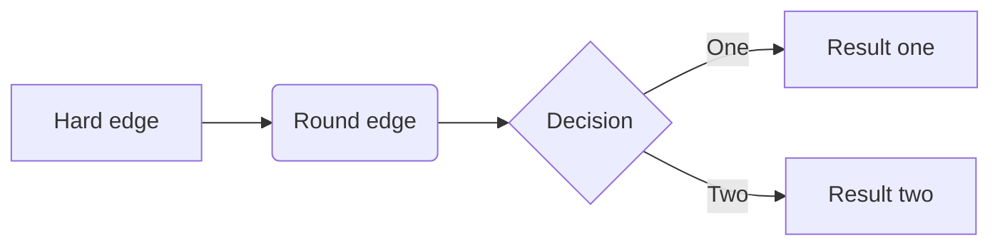

# HOMEPAGE

<br>


## Introduction


Link to my Bio and work here

$$
\mathbf{V}_1 \times \mathbf{V}_2 =  \begin{vmatrix}
\mathbf{i} & \mathbf{j} & \mathbf{k} \\
\frac{\partial X}{\partial u} &  \frac{\partial Y}{\partial u} & 0 \\
\frac{\partial X}{\partial v} &  \frac{\partial Y}{\partial v} & 0 \\
\end{vmatrix}
$$


## Github Repos

* [Varangian-Core](https://varangian-core.github.io)
 * more links here

## More Samples

```javascript
all = [...Array(10).keys);
t = "here";
console.log("Test %s", t)
````


### Table Test Here

| Date                  | Version   | Size    | Comment                |
| :-----------          | :-------- | :------ | :--------------------- |
| Jan 28, 2022          | v.10      | 2kb     | Test                   |


#### Pie Chart




#### Flow Chart



